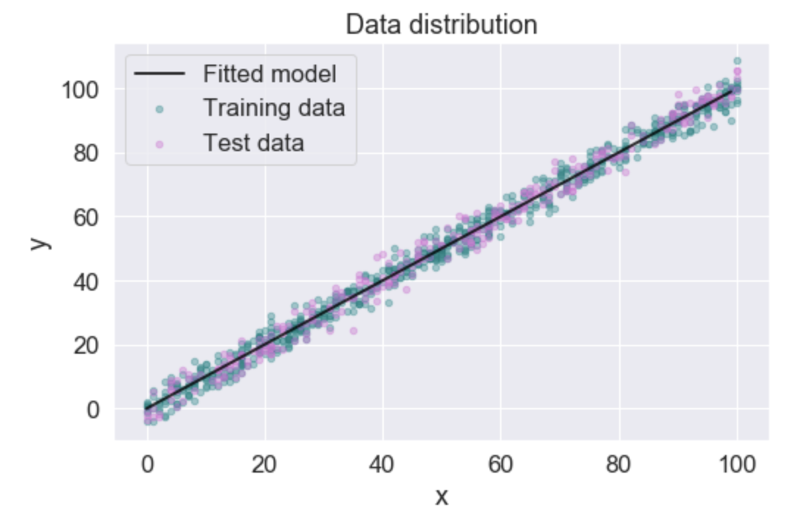

# Regression
Simple demonstrations of various regression models

## Linear regression
Simple demonstration of how to implement Linear Regression using **`scikit-learn`**. The data was taken from [this challenge](https://www.kaggle.com/andonians/random-linear-regression) for comparability reasons. Final R squared score was 0.9907.
 

### Requirements
**`Numpy`**
**`Pandas`**
**`Matplotlib`**
**`Seaborn`**
**`Scikit-learn`**
